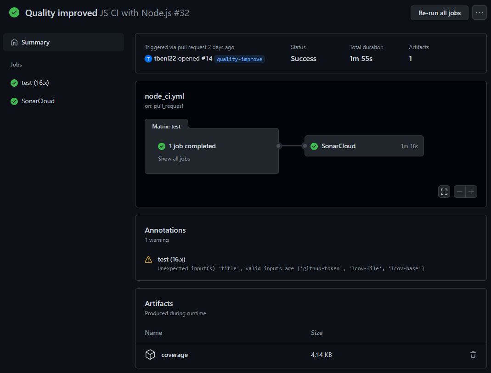

# CI action beüzemelése

## Elgondolás

A cél az volt, hogy a csapat a későbbiekben módosítás után azonnali képet kapjon a projekt állapotáról. Ezt egy Github Action segítségével terveztem megoldani, ami a már megtalálható (és később kiegészített) teszteket futtatni fogja a felhőben.

## Megvalósítás

Az elkészült CI script nem csak a teszteket futtatja, tehát az alapból kitűzött célt éri el, hanem integrálva lett bele az kódlefedettség mérése és a SonarCloud vizsgálat futtatása is. A lefedettségi vizsgálat eredményét a githubon egy kommenttel közli a felhasználóval, és az adatokat egy artifact-be is feltölti, ami egyrész később letölthető, másrészt a SonarCloud vizsgálat is ezt használja az egyik adatforrásaként. A két feladatot külön job-ra bontottam, így akár egymástól függetlenül újrafuttathatóak.

A munka során többször hasznunkra vált a CI action, mivel több hibát is észre tudtunk vele venni. A tapasztalataim alapján nagyon hasznos eszköz a Github Actions, és most hogy már jobban meg is értettem a működödését, én is használni fogom a projektjeimben.
