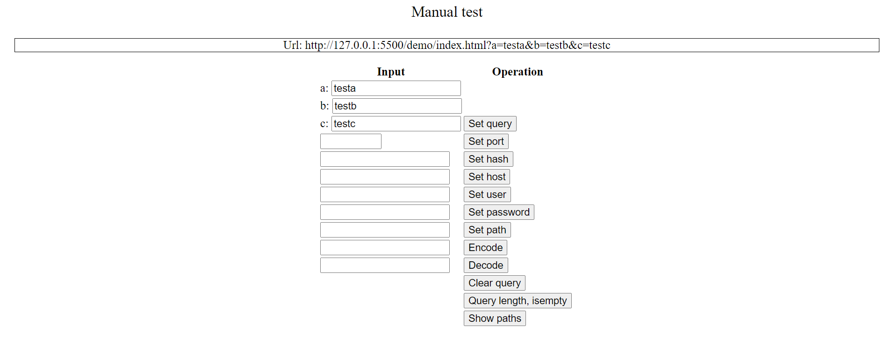
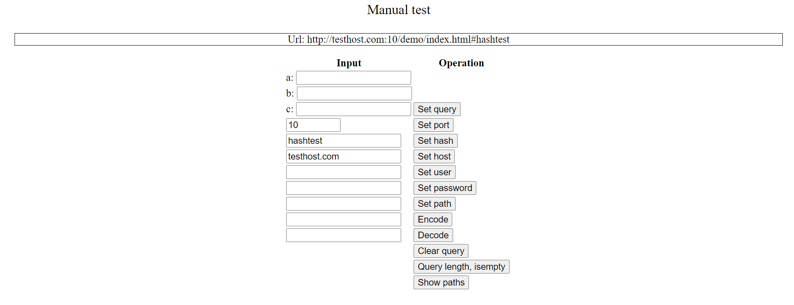
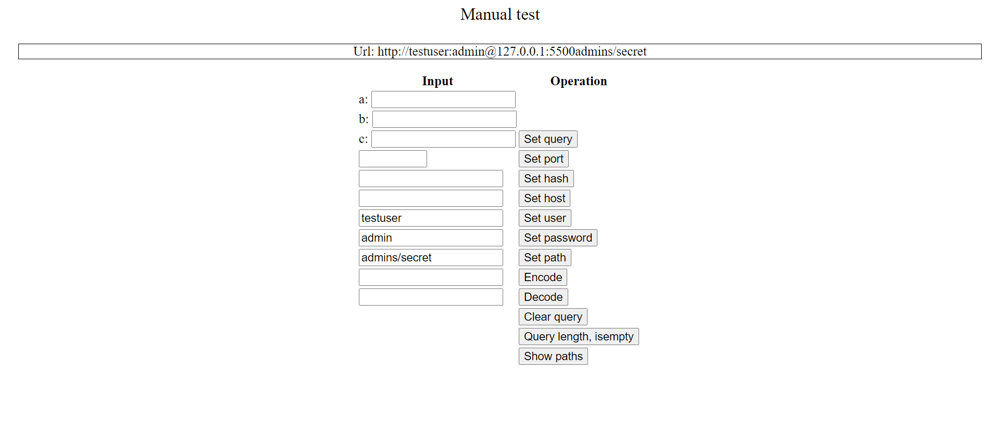
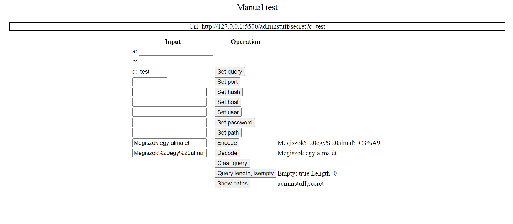

# Manuális tesztelés
## Előkészületek

Cél: a könyvtár által publikált metódusok és propertyk átfogó manuális tesztelése több böngészőben. A forráskód áttanulmányozása után megírtam a teszteket.

## Megvalósítás

A teszteléshez nem használtam keretrendszert, egyszerű HTML és JavaScript fájlokból áll. Amennyiben egy teszthez paramétert kell megadni, egy textboxon keresztül lehetséges. Betöltéskor az oldal tetején látható a kezdeti url, a későbbiekben itt látszanak az elvégzett manipulációk eredményei.

## Teszt eremények
Az alábbi böngészőkön futottak a tesztek:
-  Chrome (Version 101.0.4951.67)
-  Edge (Version 101.0.1210.47 )
-  Firefox (Version 100.0.1)

### Query paraméterek módosítása

## Port, hash, host módosítás

## Felhasználó, jelszó és útvonal beállítása

## Enkódolás, dekódolás, egyéb

A tesztek az elvárt eredményt hozták. A test mappában található unit tesztek is lefutottak mindegyik tesztelt böngészőben.
